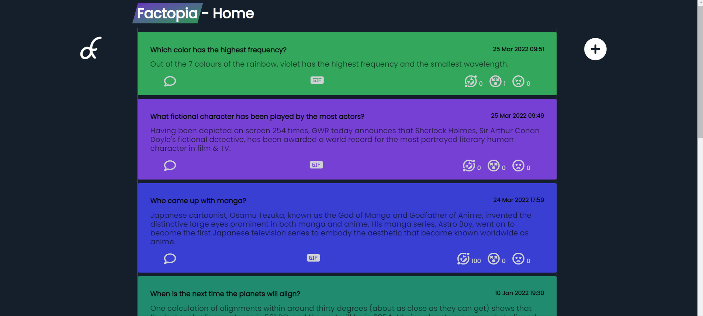

# Factopia

An anonymous fact posting site where anyone can post a fact with a title and description, as well as reply with comments and gifs and react via emojis to existing posts.

## Demo

## Contributors

- Sidar
- Ikenna
- Luiz
- Sarushan

## Installation

### Local Hosting

- Clone or download the repo
- Open the terminal and navigate to server folder
- Input `cd server` in terminal to navigate to folder with `package.json` file
- Run `npm init -y` to initialize dependencies
- Run `npm install` to install dependencies

### Remote Hosting

- API is hosted on heroku in https://factopia-api.herokuapp.com/
- Website is deployed on netlify in https://factopia.netlify.app

### Usage

- Run `npm run dev` in server folder to start with nodemon or `npm start` to run with node
- To run client tests, cd into client folder and input `npm test` into terminal. For server tests, cd into server folder and input `npm test` into terminal. For respective coverage reports, input `npm run coverage` in the terminal

## Technologies

### Front End:

- HTML/CSS
- JavaScript
- Giphy API

### Backend:

- Node.js
- Express.js
- Cors
- Nodemon

## Wins and Challenges

### Wins

- Inserting Giphy API into client and being able to respond with gifs as comments.
- Being able to push new data into the API and fetch data back to the client when webpage is refreshed.
- Deploying out front-end to Netlify and backend to Heroku

### Challenges

- Had difficulty in the beginning with linking our api to our client website.
- There was a bug where adding and removing a reaction would update the counter on the webpage, but the api would not register removing the reaction. This was eventually fixed and we had it working as we originally planned.
- Posting comments would only update on client site but would not update into the API. This was fixed and working as intended.

## Future Features

- A sort feature so people can sort through facts by most liked fact or most disliked fact.
- Gif functionality when creating a post so gifs can appear in a post.
- A searchbar were specific facts can be found by the input e.g Searching for 'fish' gathers all facts with 'fish' in the title
